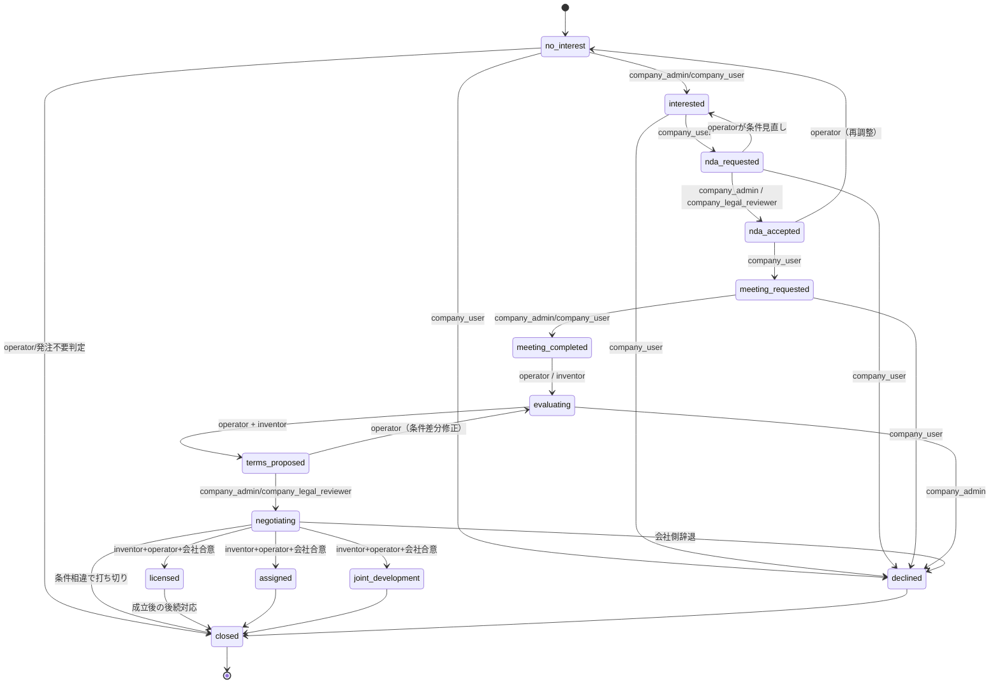

# 取引パイプライン図（MVP）

## 1. Mermaid StateDiagram

## 2. 取引種別の位置づけ

- `transfer`（完全譲渡）
  - 成立後は `assigned`
- `license_exclusive` / `license_non_exclusive`（独占/非独占）
  - 成立後は `licensed`
- `joint_development`
  - 成立後は `joint_development`
- `poc`（実証実験）
  - 通常は `negotiating` の途中ステップで条件提示
- `option`
  - 先行の権利確約がある場合に `terms_proposed` へ反映し、期間経過で `closed`

## 3. 成功報酬イベントの発生想定

- `nda_accepted`
  - 初期費用/手数料候補。`revenue_events.event_type = pre_nda_fee`
- `terms_proposed` の合意更新
  - 条件確定で `terms_updated`、必要時に `revenue_events.event_type = success_fee`
- `licensed/assigned/joint_development`
  - 成立時に `revenue_events.event_type = license_fee / transfer_fee / development_fee`
- ロイヤリティ条件
  - `revenue_events.event_type = royalty_settlement` として実績タイミングで追加

## 4. 弁護士/弁理士確認が必要な地点

### 弁護士確認
- `terms_proposed`（権利範囲・地域・用途・競業制限・違反時救済）
- `negotiating`（契約条項の主要差分）
- `licensed/assigned/joint_development` 直前

### 弁理士確認
- `company_disclosure_ready` 相当から `negotiating` へ進む際の知財要件再確認
- 先行技術差分、請求実質、再設計条件を必要に応じて追加確認

## 5. 通知タイミング（イベント）

- `interested` 登録: 発明者へ即時
- `nda_requested`/`nda_accepted`: 双方同時通知
- `meeting_requested`: 参加者通知
- `terms_proposed` 更新: 1営業日以内共有
- `negotiating`: 条件差分・進行状況を inventor/運営に共有
- `licensed/assigned/joint_development`: 成立通知＋必要資料期限提示
- `declined/closed`: 閉鎖理由を保存して発明者に通知

## 6. 監査ログ対象

- `deal_status_changed`
- `deal_terms_updated`
- `nda_requested` / `nda_accepted`
- `meeting_requested` / `meeting_completed`
- `terms_proposed` の差分
- 成功報酬イベント登録（`revenue_event_recorded`）
- `company_invention_views` の同時参照ログ

## 7. Mermaid記法上の注意

- 実装時は「会社側単独アクション」と「運営承認アクション」を API レイヤでガード。
- 本図は簡略化しており、`deal_status` と `deal_type` の同時制約（例: PoC でも最終的に licensed に遷移可能）は別バリデーションとして保持。
