# ER図（MVP）

## 1. Mermaid ER図

```mermaid
erDiagram
    users_profile {
        uuid id PK
        uuid organization_id FK
        text email
        text display_name
        role role
        boolean is_active
        timestamptz created_at
        timestamptz updated_at
        timestamptz deleted_at
    }

    organizations {
        uuid id PK
        text name
        text type
        text slug
        boolean is_active
        timestamptz created_at
        timestamptz updated_at
        timestamptz deleted_at
    }

    organization_members {
        uuid id PK
        uuid organization_id FK
        uuid user_id FK
        text member_role
        boolean is_owner
        text status
        timestamptz invited_at
        timestamptz accepted_at
        timestamptz created_at
        timestamptz updated_at
    }

    inventions {
        uuid id PK
        uuid owner_id FK
        text title
        text submission_status
        text disclosure_level
        boolean is_public_info
        boolean co_inventor_exists
        boolean ownership_risk_flag
        boolean third_party_content_risk
        boolean nda_pre_summary_ready
        timestamptz created_at
        timestamptz updated_at
        timestamptz deleted_at
    }

    invention_files {
        uuid id PK
        uuid invention_id FK
        uuid uploaded_by FK
        text file_name
        text storage_bucket
        text storage_path
        file_scope file_scope
        boolean is_deleted
        timestamptz created_at
        timestamptz updated_at
    }

    invention_status_events {
        uuid id PK
        uuid invention_id FK
        text from_status
        text to_status
        uuid actor_id FK
        text actor_role
        text reason_code
        text notes
        disclosure_level ip_block_level_after
        timestamptz created_at
    }

    invention_submission_checks {
        uuid id PK
        uuid invention_id FK
        boolean is_inventor_self
        boolean has_co_inventor
        boolean already_public
        boolean third_party_content_used
        boolean summary_for_company_pre_nda_ok
        boolean can_split_disclosure
        text check_status
        jsonb agreement_snapshot
        timestamptz created_at
        timestamptz updated_at
    }

    invention_screening_reports {
        uuid id PK
        uuid invention_id FK
        uuid operator_id FK
        text decision
        text summary
        text[] strengths
        text[] risks
        text[] recommended_actions
        integer version
        timestamptz expires_at
        timestamptz created_at
        timestamptz updated_at
    }

    invention_screening_scores {
        uuid id PK
        uuid report_id FK
        uuid invention_id FK
        text axis
        smallint score
        boolean reject_condition_hit
        timestamptz created_at
    }

    prior_art_items {
        uuid id PK
        uuid invention_id FK
        uuid screening_report_id FK
        text source_kind
        text source_ref
        text title
        text summary
        smallint similarity_level
        timestamptz created_at
    }

    ip_strategy_notes {
        uuid id PK
        uuid invention_id FK
        ip_strategy strategy
        ip_strategy[] alternative_strategies
        text strategy_rationale
        boolean attorney_review_required
        boolean lawyer_review_required
        boolean finalized
        timestamptz created_at
        timestamptz updated_at
    }

    company_accounts {
        uuid id PK
        text name
        text status
        text country
        text[] industry
        text nda_template_version
        text review_state
        uuid reviewed_by FK
        timestamptz created_at
        timestamptz updated_at
        timestamptz deleted_at
    }

    company_members {
        uuid id PK
        uuid company_id FK
        uuid user_id FK
        role member_role
        boolean is_primary_contact
        text status
        timestamptz invited_at
        timestamptz accepted_at
        timestamptz created_at
    }

    nda_acceptances {
        uuid id PK
        uuid company_id FK
        uuid user_id FK
        uuid invention_id FK
        uuid deal_pipeline_id FK
        disclosure_level disclosure_level
        text status
        text agreement_version
        timestamptz agreed_at
        timestamptz expires_at
        timestamptz created_at
    }

    company_disclosure_requests {
        uuid id PK
        uuid invention_id FK
        uuid company_id FK
        uuid requester_id FK
        disclosure_level target_level
        text status
        uuid operator_reviewed_by FK
        disclosure_level approved_level
        boolean competing_block
        timestamptz created_at
        timestamptz updated_at
    }

    company_invention_views {
        uuid id PK
        uuid invention_id FK
        uuid company_id FK
        uuid user_id FK
        uuid disclosure_request_id FK
        disclosure_level disclosure_level
        uuid viewed_file_id FK
        text view_type
        inet ip
        text session_id
        timestamptz created_at
    }

    deal_pipeline {
        uuid id PK
        uuid invention_id FK
        uuid company_id FK
        uuid disclosure_request_id FK
        deal_status status
        text deal_type
        text next_action_owner
        text result_reason
        uuid created_by FK
        timestamptz closed_at
        timestamptz created_at
        timestamptz updated_at
        timestamptz deleted_at
    }

    deal_status_events {
        uuid id PK
        uuid deal_id FK
        deal_status from_status
        deal_status to_status
        uuid actor_id FK
        role actor_role
        text action_reason
        jsonb terms_json
        timestamptz created_at
    }

    revenue_events {
        uuid id PK
        uuid deal_id FK
        uuid invention_id FK
        text event_type
        numeric amount
        text currency
        timestamptz scheduled_at
        timestamptz realized_at
        text memo
        timestamptz created_at
    }

    audit_logs {
        uuid id PK
        timestamptz event_at
        uuid actor_user_id FK
        role actor_role
        text event_type
        text event_action
        text target_type
        uuid target_id
        uuid related_invention_id
        uuid related_company_id
        uuid related_deal_id
        text metadata
        text request_id
        inet ip
        text user_agent
        timestamptz created_at
    }

    users_profile ||--o{ inventions : "owner"
    users_profile ||--o{ organization_members : "member"
    users_profile ||--o{ company_members : "company member"
    users_profile ||--o{ invention_files : "upload"
    users_profile ||--o{ invention_status_events : "actor"
    users_profile ||--o{ invention_screening_reports : "operator"
    users_profile ||--o{ invention_screening_reports : "author"
    users_profile ||--o{ invention_submission_checks : "editor"
    users_profile ||--o{ nda_acceptances : "signer"
    users_profile ||--o{ company_disclosure_requests : "requester"
    users_profile ||--o{ company_invention_views : "viewer"
    users_profile ||--o{ deal_pipeline : "initiator"
    users_profile ||--o{ deal_status_events : "actor"
    users_profile ||--o{ audit_logs : "actor"

    organizations ||--o{ organization_members : "includes"

    inventions ||--o{ invention_files : "has"
    inventions ||--o{ invention_status_events : "history"
    inventions ||--o{ invention_submission_checks : "checklist"
    inventions ||--o{ invention_screening_reports : "screening"
    inventions ||--o{ invention_screening_scores : "axis scores"
    inventions ||--o{ prior_art_items : "prior art"
    inventions ||--o{ ip_strategy_notes : "ip strategy"
    inventions ||--o{ company_disclosure_requests : "requested"
    inventions ||--o{ company_invention_views : "view logs"
    inventions ||--o{ deal_pipeline : "trade candidates"
    inventions ||--o{ revenue_events : "revenue basis"

    invention_screening_reports ||--o{ invention_screening_scores : "contains"
    prior_art_items }o--|| invention_screening_reports : "evidence for"

    company_accounts ||--o{ company_members : "belongs"
    company_accounts ||--o{ nda_acceptances : "acceptances"
    company_accounts ||--o{ company_disclosure_requests : "disclosure"
    company_accounts ||--o{ deal_pipeline : "pipeline"
    company_accounts ||--o{ company_invention_views : "view logs"

    company_members }o--|| users_profile : "maps"
    organization_members }o--|| users_profile : "maps"
    nda_acceptances }o--|| inventions : "scope by invention"
    nda_acceptances }o--|| deal_pipeline : "scope by deal"
    company_disclosure_requests ||--o{ deal_pipeline : "source (optional)"
    deal_pipeline ||--o{ deal_status_events : "status history"
    deal_pipeline ||--o{ revenue_events : "event basis"
```

## 2. 主要関係の説明

- `users_profile` が起点になり、`inventions` の発明者、`company_members` の担当者、`company_disclosure_requests` の申請者、`deal_pipeline` の関与者として参照されます。
- `organizations` は内部ユーザーの所属用に先行設計。`company_accounts` は法人アカウントの業務向けテーブルとして分離。
- `inventions` は主軸テーブルで、ファイル、ステータス履歴、投稿前チェック、診断、先行技術、知財方針、開示リクエスト、取引の中核です。
- ファイルはすべて private bucket 前提で `invention_files.file_scope` で開示レベルを制御します。
- `deal_pipeline` は交渉の取引履歴を保持し、`deal_status_events` と `revenue_events` は監査・会計連携用の履歴を保持します。
- `audit_logs` は共通監査基盤として `invention`, `company`, `deal` のイベントを横断的に記録する想定です。

## 3. MVPでの意図的簡略化

- `organizations` と `company_accounts` の実務統合を先送りし、当面は責務を分離。
- 地域別権利範囲、請求項、契約条文、監査署名、請求通知設定は別テーブルに切らず、MVPでは `jsonb` とメモ欄で暫定管理。
- 料金・請求・請求イベントの詳細明細は MVP では `revenue_events` を簡易保持。
- 権限テーブルは enum と列ベース管理を前提としているため、ロール継承やグループ権限は将来拡張。

## 4. 未決事項

- `organizations` と `company_accounts` の関係
  - 現状、どちらも組織関連ですが、責務分離を優先して直結を保留。
  - `organizations` は `users_profile` 側の運営・提携基盤を想定。
  - `company_accounts` は企業閲覧主体の運用単位を想定。
  - 実装前に「同一組織=1対1」か「1対多」を決める。
- `organization_members` は MVP では `company_members` と一部重なるため、重複排除ルールを未確定。
- 監査ログの event schema（JSON標準）は将来の監査要件で固定化が必要。
