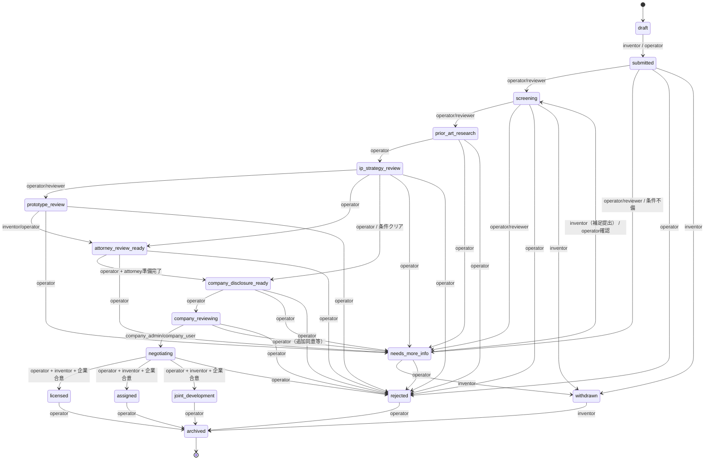

# 発明ステータス遷移図（MVP）

## 1. Mermaid StateDiagram

## 2. 遷移者（誰が遷移できるか）

- `draft` / `submitted` の登録・編集: `inventor`, `operator`
- 診断・先行技術・知財検討: `operator`, `reviewer`
- 弁理士準備完了、企業開示準備: `operator`
- 企業閲覧関連遷移: `operator`（承認）/ `company_admin`, `company_user`（閲覧要求起点）
- 交渉移行: `operator`, `inventor`, `company_admin`
- 終了・中断: `operator`, `inventor(取下げ)`

## 3. 正常系遷移

- `draft -> submitted`
- `submitted -> screening -> prior_art_research -> ip_strategy_review`
- `ip_strategy_review -> attorney_review_ready -> company_disclosure_ready -> company_reviewing`
- `company_reviewing -> negotiating`
- `negotiating -> licensed|assigned|joint_development`

## 4. 差し戻し遷移

- `needs_more_info` は `submitted`, `screening`, `prior_art_research`, `ip_strategy_review`, `prototype_review`, `attorney_review_ready`, `company_disclosure_ready`, `company_reviewing` へ戻すための保留状態。
- `needs_more_info -> screening` へ発明者追加入力後に戻す。
- `draft` 直前ではなく、提出済み後の差戻しを原則採用し、再申告ログを残す。

## 5. 終了系遷移

- `rejected`: 初期判断で見送り（再申請は新規案件で扱う想定）
- `withdrawn`: 発明者による自己取り下げ
- `archived`: `licensed/assigned/joint_development/rejected/withdrawn` の後段。

## 6. 遷移時に必須の監査ログ

- `status_changed` イベント: `invention_status_events` への追加必須
- `actor_id`, `actor_role`, `from_status`, `to_status`, `reason_code` の記録
- 遷移条件に関わる `submission_check_id` / `disclosure_request_id` / `deal_id` の参照。
- `needs_more_info` 遷移時は `required_input` を記録（不足項目の一覧）。

## 7. 発明者表示と内部ステータスの違い

### 発明者向け表示
- `draft`: 下書きで編集可能
- `submitted`: 受理、審査中
- `screening`: 審査進行中
- `prior_art_research`: 類似性確認中
- `needs_more_info`: 追加依頼あり
- `company_reviewing`: 企業検討の可視化のみ
- `negotiating`: 交渉中
- `licensed/assigned/joint_development`: 成立状況
- `rejected/withdrawn`: 見送り

### 内部表示
- `ip_strategy_review`, `prototype_review`, `attorney_review_ready`、`company_disclosure_ready` は業務上の内部フェーズとして運営のみ表示。
- `company_reviewing` には開示レベルと競合制御の条件を含めて表示差分。

## 8. Mermaid記法上の注意

- `stateDiagram-v2` ではノード名にハイフンを含める場合は引用符が必要になることがあるため、ここでは `snake_case` を採用。
- 企業合意の条件分岐はテキストラベルで表現し、厳密なガード条件は実装時に RLS / API で再定義。
