# 権限境界図（role / permission）

## 1. Mermaid Flowchart

```mermaid
flowchart TD
    subgraph Roles
        inventor[inventor]
        operator[operator]
        reviewer[reviewer]
        patent_partner[patent_attorney_partner]
        company_user[company_user]
        company_admin[company_admin]
        company_legal[company_legal_reviewer]
        admin[admin]
        service_role[service_role]
    end

    subgraph RLS_Resources[「RLSで守る」主要リソース]
        UP[users_profile]
        ORG[organizations]
        OM[organization_members]
        ORGM[organization_members]
        INV[inventions]
        IFILE[invention_files]
        ICHECK[invention_submission_checks]
        ISTATUS[invention_status_events]
        IREPORT[invention_screening_reports]
        ISCORE[invention_screening_scores]
        PRIOR[prior_art_items]
        IPNOTE[ip_strategy_notes]
        CA[company_accounts]
        CM[company_members]
        NDA[nda_acceptances]
        CREQ[company_disclosure_requests]
        CVIEW[company_invention_views]
        DEAL[deal_pipeline]
        DEALE[deal_status_events]
        REV[revenue_events]
        AUD[audit_logs]
        FILE[private file storage]
        SIGN[signed URL API]
    end

    subgraph APIGuard[「API側で守る」追加境界]
        INV_TRANS[ステータス遷移妥当性]
        NDA_GUARD[NDA未成立拒否]
        DISC_BOUND[開示レベル境界]
        COMP_BOUND[競合企業制御]
        COMP_LOG[閲覧ログ必須]
        ROLE_GUARD[取引権限制御]
        EXPORT_GUARD[監査エクスポート権限]
    end

    inventor -->|read/write: own drafts, own statuses, own files| INV
    inventor --> ICHECK
    inventor -->|view own audit summary| AUD

    operator -->|read/write inventions| INV
    operator --> IFILE
    operator --> ISTATUS
    operator --> IREPORT
    operator --> ISCORE
    operator --> PRIOR
    operator --> IPNOTE
    operator --> CREQ
    operator -->|manage| DEAL
    operator --> AUD

    reviewer -->|readonly reviews| INV
    reviewer --> IREPORT
    reviewer --> ISTATUS

    patent_partner -->|read: strategy/screening refs| INV
    patent_partner --> IREPORT
    patent_partner --> PRIOR

    company_user -->|read: level1| CREQ
    company_user --> CVIEW
    company_user --> INV
    company_user --> DEAL

    company_admin -->|request/update with gate| CREQ
    company_admin --> NDA
    company_admin --> DEAL
    company_admin -->|download via approved level| SIGN
    company_admin --> CVIEW

    company_legal -->|readonly legal views| DEAL
    company_legal -->|legal review updates| CREQ
    company_legal --> DEALE

    admin -->|full CRUD policy mgmt| UP
    admin --> ORG
    admin --> INV
    admin --> DEAL
    admin --> AUD

    service_role -->|storage signed URL creation| SIGN
    service_role -->|automated cleanup / expiry jobs| NDA
    service_role -->|export logs| AUD
    service_role -->|audit integrity checks| AUD

    %% resource edges for guards
    INV --> INV_TRANS
    CVIEW --> COMP_LOG
    SIGN --> NDA_GUARD
    SIGN --> DISC_BOUND
    CREQ --> COMP_BOUND
    DEAL --> ROLE_GUARD
    AUD --> EXPORT_GUARD
```

## 2. role別に触れる主要リソース

- `inventor`
  - 自案件の `inventions` 作成/更新、`invention_files` アップロード、自己の `invention_submission_checks`
- `operator`
  - 全体運営テーブル（`inventions`, `status`, `screening`, `prior art`, `ip_strategy`, `deals`, `audit` の参照/更新）
- `reviewer`
  - 運営側レビュー限定（主に `screening` と関連資料）
- `patent_attorney_partner`
  - 相談向け参照のみ（レビュー対象の抜粋）
- `company_user`
  - 承認後のレベルに応じた閲覧・要約レベルの `inventions` / `creq` / `deal` 参照
- `company_admin`
  - 開示申請・NDA・取引進行（公開条件内）
- `company_legal_reviewer`
  - 取引条件のレビューと法務観点の承認
- `admin`
  - 全体管理、監査、ロール/アカウント操作
- `service_role`
  - signed URL 発行、期限切れ処理、ログ保全など運用バッチ向けのみ

## 3. RLSで守ること / API側で守ること

### RLSで守る
- 自件/他件分離（発明者の案件制御）
- 所属会社と `company_members` 制御
- `deleted_at` を含む論理削除除外
- `audit_logs` 本体の閲覧制限（admin中心）

### API側で守る
- status の遷移妥当性（無効遷移を弾く）
- 企業開示のNDA/同意境界、競合制御、閲覧ログ必須
- `private file` の scope 照合と signed URL TTL
- 取引ステータスの権限チェックと成功報酬生成条件

## 4. service_roleのみ許可

- private storage からの署名URL発行
- NDAの自動期限切れ処理
- 一括ログエクスポート（監査監査）
- バッチでのアーカイブ/整合性チェック

## 5. 企業のNDA前/後の見える範囲

- NDA前: `level_1_company_teaser` まで
- NDA後: `level_2_nda_summary` 以降（NDA有効性と `nda_acceptances` に依存）
- いずれも `company_invention_views` 未保存の詳細返却は禁止

## 6. private file / signed URL / audit logの境界

- `invention_files` は直接パスを返さない。
- 署名URLはAPI経由で `SIGNED_URL` を発行し、役割・レベル・NDA・監査を一括検証。
- `download_denied` / `file_viewed` は監査イベントとして保存。

## 7. Mermaid記法上の注意

- サブグラフ名やノード名は空白なしで記述し、可読性向上のため日本語はラベルで付与。
- 実装時は権限を厳密化するため、実ノードの属性に `permission` を追加して別図（permission matrix）でも確認。
